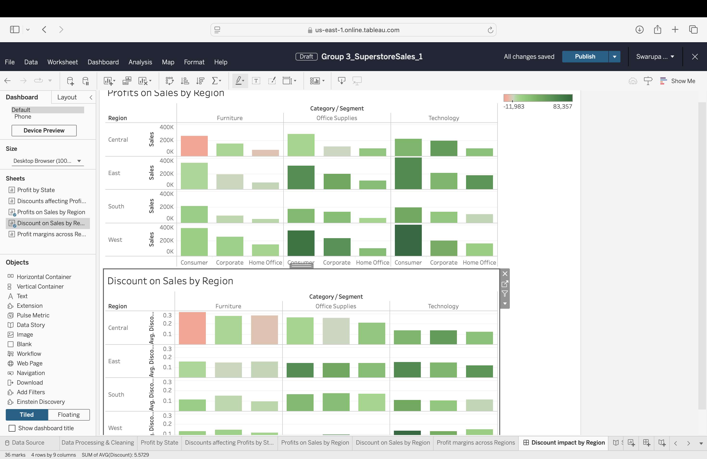
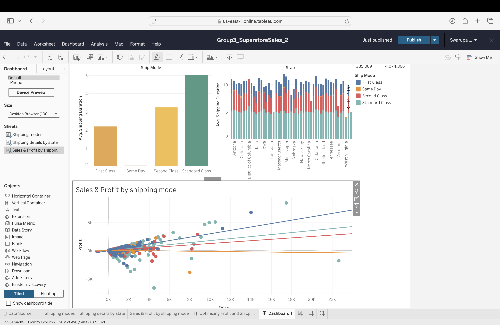
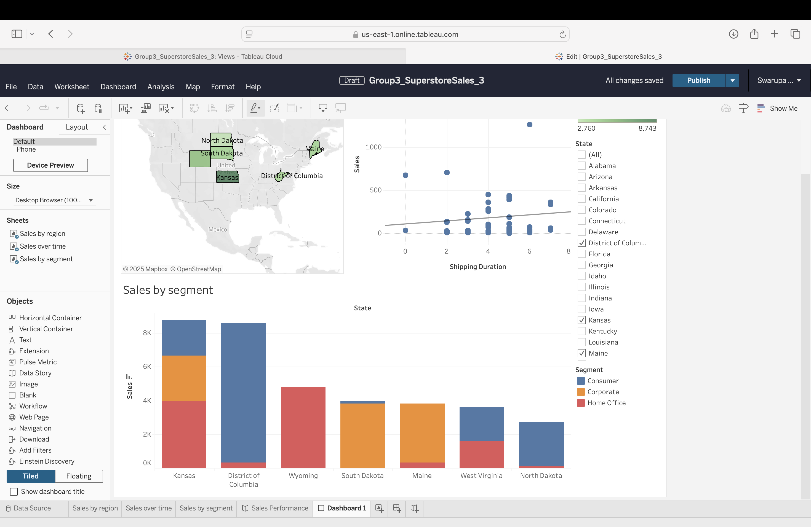
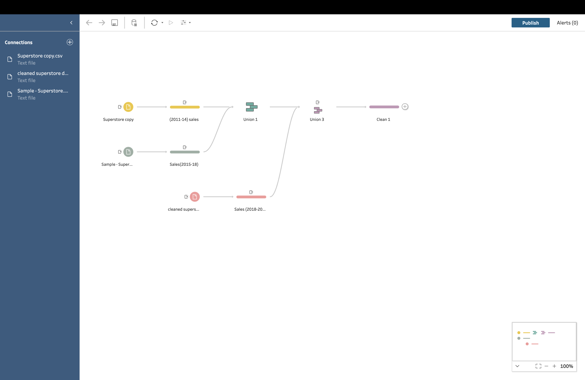

# 📊 Tableau Data Visualization Project

# Super Store Sales
Superstore Sales Data Analysis & Visualization – Tableau Project
This project explores Superstore Sales trends over multiple time periods, focusing on sales performance, customer behavior, and regional profitability. The data was cleaned and merged using Tableau Prep Builder, and interactive Tableau dashboards were created to answer three strategic business questions using descriptive, predictive, and prescriptive analytics.

💡 Key Highlights:

📊 Sales performance trends across different time periods.  
🏆 Customer segmentation & buying patterns analysis.  
🌍 Geographical sales insights for better decision-making.  
🔄 Data cleaning & transformation using Tableau Prep.  
📈 Interactive dashboards & visual storytelling.  

## 📌 Strategic Questions 
### **1️⃣ Strategic Question - What factors are driving changes in profit margins across different regions?**
   - **Descriptive:** What are the profit trends across regions over the years?
   - **Predictive:** Can regional sales and discounts predict future profit margins??
   - **Prescriptive:** What strategies should be implemented to improve profits in low-performing regions??

🔹 **Dashboard Screenshot:**  

### **2️⃣ Strategic Question 2 -	How do profit and shipping times vary across different states, and how can we improve them?**
   - **Descriptive:** What are the average shipping times for each shipping mode in different states? ?
   - **Predictive:** What patterns and correlations can be identified between shipping modes, shipping times, and sales?
   - **Prescriptive:** What logistics improvements can be made to optimize shipping times and increase profits?

🔹 **Dashboard Screenshot:**  

### **3️⃣ Strategic Question 3 - 	How can we improve sales performance in states with less sales, considering factors like shipping duration and customer segments?**
   - **Descriptive:** What states are showing less sales? 
   - **Predictive:** Can improving shipping durations boost future sales performance?
   - **Prescriptive:** What strategies can boost sales in these states?

🔹 **Dashboard Screenshot:** 

---

## 📊 Data Processing & Cleaning
To ensure accurate visualizations, we used **three different datasets from different time periods**. The data was cleaned and merged using **Tableau Prep Builder**.

### 📂 **Dataset Overview**
| Dataset Name       | Time Period |
|-------------------|------------|
| `Superstore copy.csv`   | 2011-2014   | 
| `Sample - Superstore.csv`   | 2015-2018   |
| `superstore dataset.csv`   | 2019-2022   | 
| `Superstore Sales.csv` | Final Merged Data(2011-2022) | Processed via Tableau Prep |

🔹 **Tableau Prep Workflow (`data_prep.tflx`)** is included in the **`tableau_prep/`** folder.

🔹 **Workflow Screenshot:** 

## 📂 Repository Structure 
- `visualizations/` → Contains **Tableau Packaged Workbook (.twbx)**, PNG/JPG exports of key Tableau dashboards.
- `data/` → Raw and cleaned datasets.
- `tableau_prep/` → **Tableau Prep workflow file (`Flow1.tflx`)** for data cleaning.
- `documentation/` → Additional documentation explaining the project-report of the analysis.
